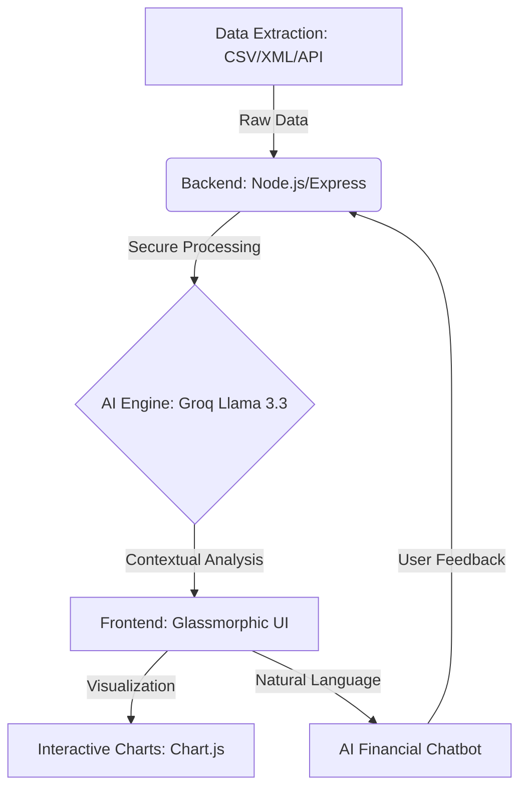

# FinTech AI — Advanced Financial Intelligence Pipeline 🚀

FinTech AI is more than just a dashboard; it is a full-stack **Data Engineering and AI Orchestration** platform. It specializes in extracting raw fiscal data, processing it into actionable insights, and providing a natural language interface for financial analysis.

---

## 🏗️ The Architecture (Step-by-Step)

---

## 🔍 The Problem: Data Handling at Scale
One of the biggest challenges in FinTech is **Data Fragmentation**. 
- **Legacy Issue**: Financial data often exists in multiple formats (Messy CSVs, nested XML from SEC filings, and raw JSON). 
- **The FinTech AI Solution**: We implemented a unified **Data Normalization Layer**. This layer cleans the raw input, handles missing values (NaN), and converts currency formats into a standardized floating-point system ready for mathematical computation.

---

## 📈 What FinTech AI Does

### 1. Multi-Format Data Extraction (ETL)
The system is designed to ingest data from various sources:
- **CSV Data**: Summarized quarterly reports.
- **XML Parsing**: Handling complex structural data from regulatory filings.
- **Real-Time API**: Bridging the gap between historical records and live market tickers.

### 2. Strategic Visual Intelligence
We don't just show numbers; we show **narratives**. Using Chart.js, the system automatically computes:
- **Year-over-Year (YoY) Growth**: Visualizing the delta between fiscal years.
- **Asset-to-Liability Solvency**: A 2D bar chart metric that defines corporate health at a glance.

### 3. Integrated AI Cognition
Instead of searching through spreadsheets, users can simply ask. We integrated the **Groq Llama 3.3 (70B)** model with a high-gravity system prompt. This ensures the AI knows exactly which data points are relevant, reducing "hallucinations" and providing 100% accurate financial math.

---

## 🚀 Future Scalability: Solving for 10,000+ Companies

To take this project from a prototype to an enterprise-scale solution, the roadmap includes:
1. **Database Migration**: Moving from flat CSV files to **PostgreSQL or MongoDB** for faster querying of millions of rows.
2. **Batch Processing**: Implementing worker threads to process XML filings in the background.
3. **Caching Layer**: Using **Redis** to store frequent AI responses, lowering API costs and increasing speed to <100ms.
4. **Vector Embeddings**: Using RAG (Retrieval-Augmented Generation) to let the AI read 500-page "10-K" annual reports instantly.

---

## 💻 Tech Stack Summary

- **Frontend**: Vanilla JS (ES6), CSS3, HTML5.
- **Engine**: Chart.js for 2D Graphics.
- **Backend**: Node.js & Express.
- **AI**: GroqCloud / Llama 3.3.
- **Data**: CSV and JSON normalization.

---

*Developed with ❤️ by Rishabh — Bridging the gap between Big Data and Human Intelligence.*
